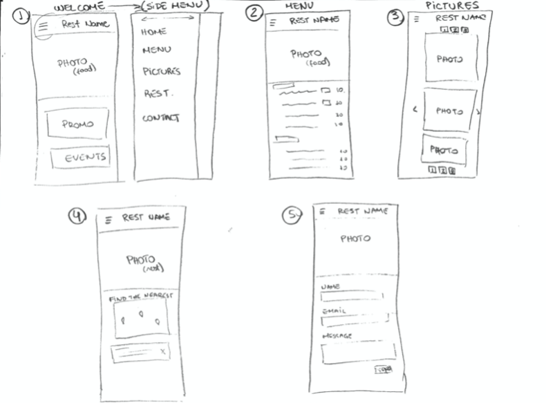
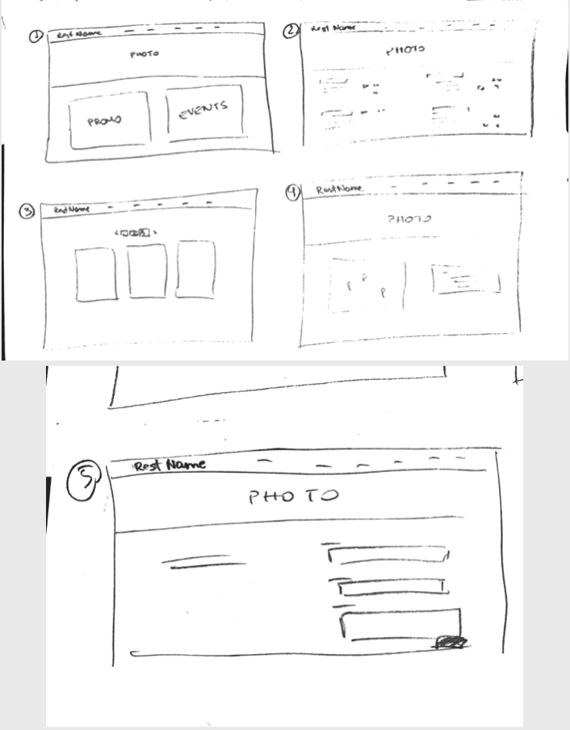

# Restaurant Website - Bootstrap Challenge

## **Autors**
Jann Basso

## **Technologies Used**
- HTML
- CSS
- Bootstrap
- Visual Studio Code
- Git / Github

## **Result**

## Goal

Create a responsive restaurat website with Bootstrap, considering the following instructions:

**Welcome** - A page with one Jumbotron and two panels to show news (promo, events, etc…​).

**Menu** - A page with the restaurant menu in the form of a grouped list with badges.

**Pictures** - A page with a gallery of minimum 10 pictures and a pagination (3 photos per page).

**Restaurant** - A page about the restaurants (it’s a franchise) with its addresses, a map, and different schedules.

**Contact** - A page with a contact form containing the firstname, lastname, email, subject of the message (a drop-down list with multiple options), an area for the message itself and a send button with an icon. Each entry as a title in a semantically correct tag.

More information [here](https://github.com/becodeorg/BXL-Swartz-4-27/blob/master/1.The-Field/6.Bootstrap/restaurant.adoc)

## **Mockups**
Smartphone

Desktop

## **Attributes**
Images from [Unsplash](https://unsplash.com/?utm_source=unsplash&amp;utm_medium=referral&amp;utm_content=creditCopyText)

Icons from [Flaticon](https://www.flaticon.com/)

